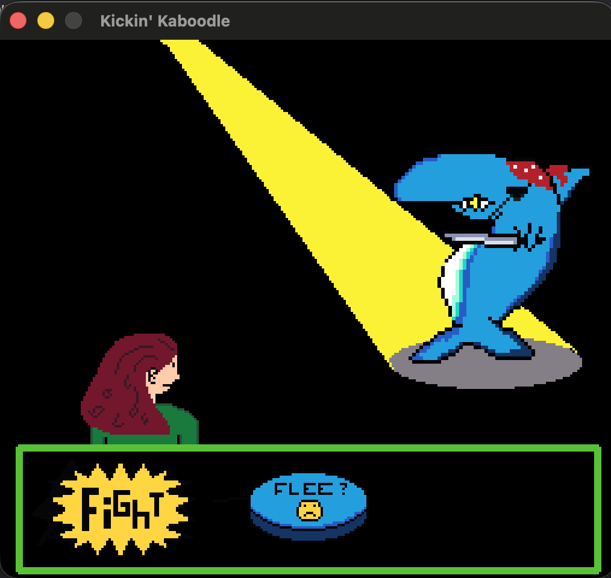
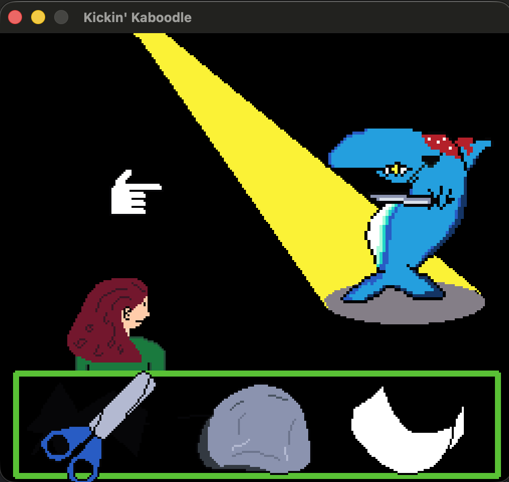

# Kickin Kaboodle

  
  
  

This is a C++ raylib RPG game inspired by EarthBound. I have always been interested in game development, and recently, I decided to start making games. I had originally started in the Godot engine, but I was dissatisfied with how little coding was involved in development. I did some searching and learned about this awesome library for C/C++ game development called Raylib. I fell in love with the process of developing games using this library, and have started the development of Kickin Kaboodle. It is an isometric RPG game with rock paper scissors style turn based combat. 
# So far, what has been developed is: 
- animation system
- menu display system
- player entity
- enemy entities
- combat screen
- overworld tilemapping

# What I am working on:
- combat animations
- inventory / items
- leveling
- much much more...

I have really enjoyed the project, but I have also realized that handwriting an entire game is a lot of work... So I have posted what I have finished so far, though it is nowhere near what I would call a playable game.
