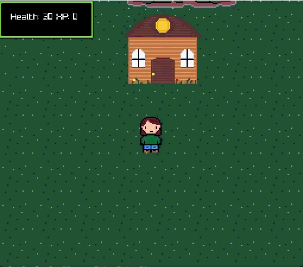
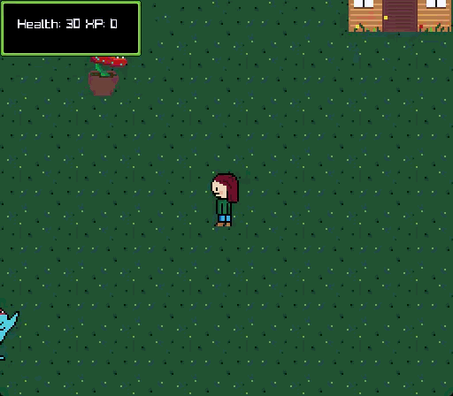

# Kickin Kaboodle

  

This is a C++ raylib RPG game inspired by EarthBound. I have always been interested in game development, and recently, I decided to start making games. I had originally started in the Godot engine, but I was dissatisfied with how little coding was involved in development. I did some searching and learned about this awesome library for C/C++ game development called Raylib. I fell in love with the process of developing games using this library, and have started the development of Kickin Kaboodle. It is an isometric RPG game with rock paper scissors style turn based combat. 

# So far, what has been developed is: 
- animation system
- menu display system
- player entity
- enemy entities
- combat screen
- overworld tilemapping
- textbox tilemapping
- shop

# What I am working on:
- combat animations
- item upgrades
- leveling
- mob pathfinding
- 

